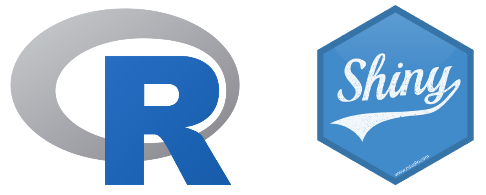

Introducction to Shiny
========================================================
author: Cristian Suarez Vera
date: 29-05-2020
autosize: true

***


What is Shiny?
========================================================

- R framework
- Easy to use for data scientis because is a know language R
- Can generate Apps easy

***
  

What is R?
========================================================

[R] is a programing language and free sofware environment for statistical computing

[R]:https://www.r-project.org/ 


```r
colnames(titanic)
```

```
 [1] "PassengerId" "Survived"    "Pclass"      "Name"        "Sex"        
 [6] "Age"         "SibSp"       "Parch"       "Ticket"      "Fare"       
[11] "Cabin"       "Embarked"   
```

What is R?
========================================================

[R] is a programing language and free sofware environment for statistical computing

[R]:https://www.r-project.org/ 


```r
summary(titanic$Age)
```

```
   Min. 1st Qu.  Median    Mean 3rd Qu.    Max.    NA's 
   0.42   20.12   28.00   29.70   38.00   80.00     177 
```

What is R?
========================================================

[R] is a programing language and free sofware environment for statistical computing

[R]:https://www.r-project.org/ 


```r
womenFirstClass <- titanic[titanic$Sex == "female" & titanic$Pclass == 1, c("Name")]
head(womenFirstClass, 5)
```

```
[1] Cumings, Mrs. John Bradley (Florence Briggs Thayer)
[2] Futrelle, Mrs. Jacques Heath (Lily May Peel)       
[3] Bonnell, Miss. Elizabeth                           
[4] Spencer, Mrs. William Augustus (Marie Eugenie)     
[5] Harper, Mrs. Henry Sleeper (Myna Haxtun)           
891 Levels: Abbing, Mr. Anthony ... Zimmerman, Mr. Leo
```

Shiny sample
========================================================

- https://shiny.rstudio.com/gallery/word-cloud.html
- https://shiny.rstudio.com/gallery/telephones-by-region.html
- https://shiny.rstudio.com/gallery/single-file-shiny-app.html

Share a Shiny project
========================================================
incremental: true

- Shiny project
- HTML, PDF
- Shiny hosting
- Our Shiny server

Applications
========================================================

- https://shiny.rstudio.com/gallery/covid19-tracker.html
- https://shiny.rstudio.com/gallery/pokemon-questions.html
- https://shiny.rstudio.com/gallery/

Other stuff with R
========================================================

- Knit
- Presentations
- Dinamic papers
